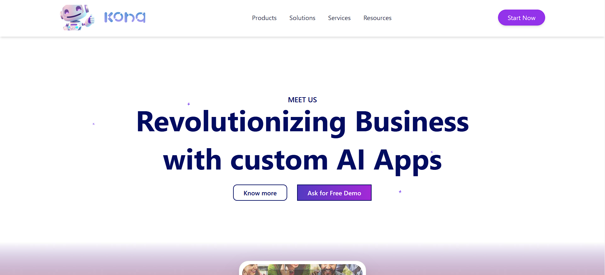
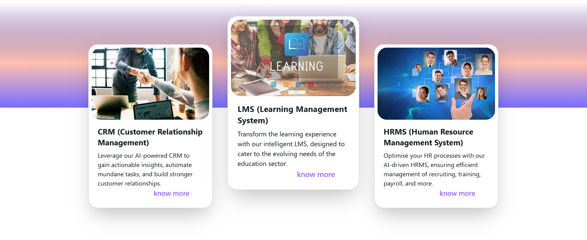
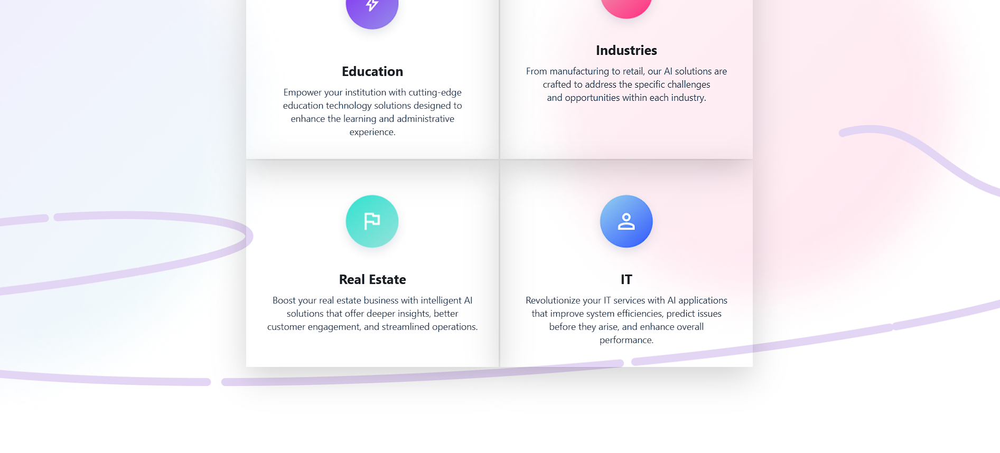
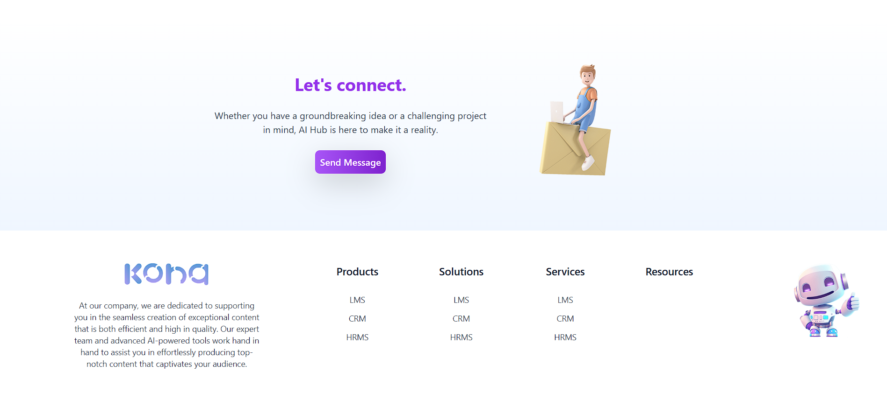

# Responsive AI Solutions Website

A responsive business website showcasing AI-powered solutions, including CRM, LMS, and HRMS. Built with modern design principles using **HTML**, **Tailwind CSS**, and **Bootstrap**.

## Features
- Modern Navbar with dropdown menus
- Interactive cards for solution highlights
- Industry-specific solution sections
- Testimonials carousel
- Call-to-action banners

## Technologies Used
- HTML5
- Tailwind CSS
- Bootstrap 5

## Getting Started
1. Clone the repository:
   ```bash
  git clone [<repository_url>](https://github.com/chamindavass/Modern-Responsive-Webpage.git)

2.Navigate to the project directory:
bash
Copy code
cd project_directory
3.Open index.html in your browser to view the website.
## Screenshots






## Acknowledgments
Kona Digital for design inspiration.
Bootstrap and Tailwind CSS for styling support.